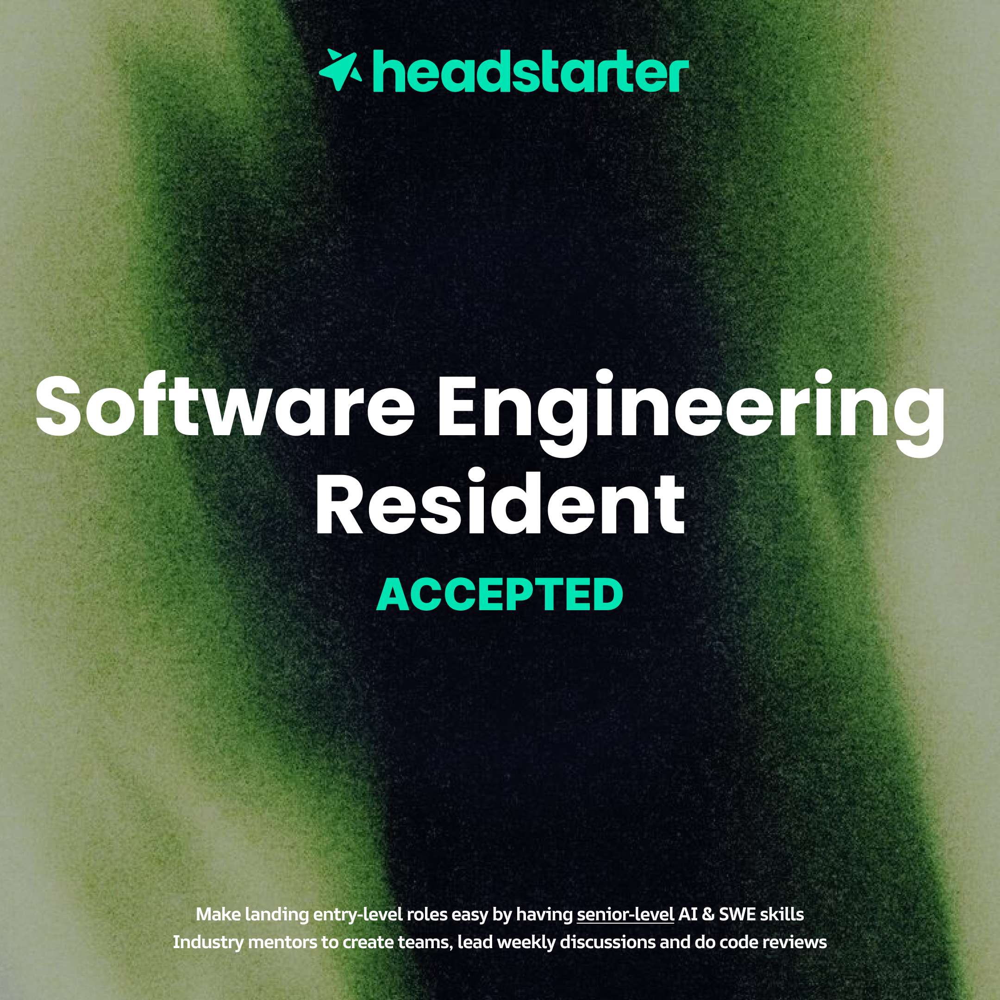
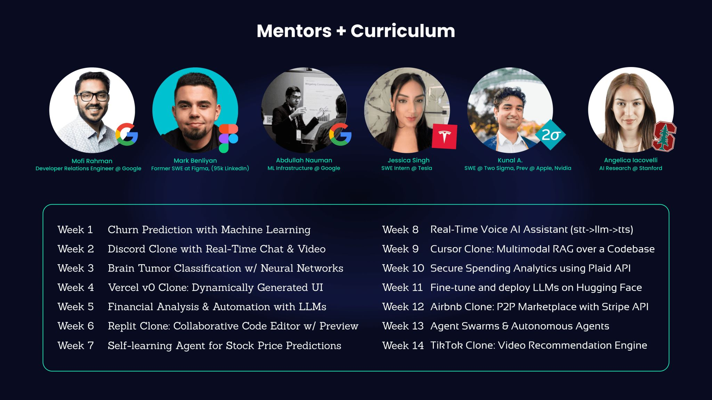

I'll be honest, I suck at making blogs. Yeah, insane news. Reality just broke and we're heading into parallel universes. Jokes aside, posting articles about technical experiences or achievement you get is important for people who want develop professionally. So, with that in mind I got accepted to the *Headstarter Accelerator Program*. 

So, what's program? Its a 14-week program where you do different projects that reflect real-world problems and how you can use AI, math and for some a bit of Web Development to solve them. Lessons are made by Faisan [], one of the co-founders of Headstarter, who worked a lot in the data science and data engineering area. Now for the 1 or 2 cats in the neighborhood who's been stalking my Github knows that I've been doing data science for some time on my uni research, and this of course tickled my fancy.

So now I'm juggling my uni course, a capstone project on codepath, research, and now this. And on top of that applying for jobs in the totally sane and fun ✨  job market ✨. Those 14 weeks will be interesting, really! I still have to update a few articles I have around, but I'll be writing my experience on each project, kinda to keep track of each. Let's see how it goes...