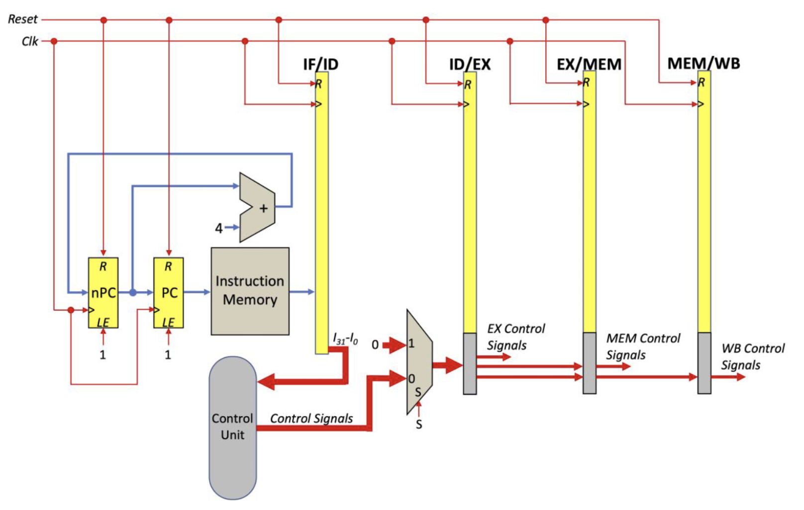

My first time getting into hardware design and probably one of the most challenging time consuming college projects I've ever got, probably will be only beaten by the CAPSTONE project I'll get on next semester.

## Overview

I worked on this project during the spring semester of 2023 and it was a 3-student project at the beginning and was part of the Computer Architecture course. We had to learn verilog and understand how a computer works at the lowest level, and using some cheat sheets as reference convert assembly instructions into binary and viceversa. We even had to recreate on hand a memory stack during a quiz, understand a circular stack and work with cache. It was quite the experience. For the course project we had to implement a fully functional architecture in *SystemVerilog*: a SPARC version 8 architecture. This implementation would take some assembly instructions in binary and execute it as if it was just a normal computer. Of course, it had its limitations. I'll take about those later in the article.

The project is broken down into 4 phases to allow an easier breakdown of said task. Additionally, I did some extra things here and there as I really wanted to experiment more and get the hang on different tools a digital design engineer would use in the industry.

Without further ado, let's start!

## Prerequisites

As with any project there are a few things to have before tackling any project that requires some technical skills. You'll need:

- *[IcarusVerilog]()* installed
- A text editor like *Sublime Text* or *Vscode*
- A copy of the [SPARC V8 architecture specifications]() book
- Draw.io on a browser or locally installed
- Some previous programming knoledge, bonus points if it so happen to be Verilog
- God's holy patience
- Git Bash (optional)

## Tools

For the unitiated, IcarusVerilog is an open-source compiler implementation of the IEEE-1364 Verilog. And what's verilog you're asking? Its a hardware description language (HDL) used to model an electronic system. Basically its  a language that allows the engineer/designer to abstract a design down to its logic functionality. No need to think about the transistor technology or where to power it up or any other detail that is not necessarily part of a general design.

## Phases

### Phase 1: Learning Verilog and our first Module

This phase is all about getting started with verilog. Students are to form teams of 3, get to know each other and start planning on who will code what. This is because all three members should learn and be familiar in coding a verilog simulation and go through the bare basics of hardware design.

Components to get done for this phase are:
- Register File
- ALU
- Instruction Memory
- Data Memory

The *register file* is a memory device that well, stores stuff.  The one used in SPARC is a module represents a **32-bit** register file with three output ports. The *data memory* is fundamentally a **RAM** with a capacity of **512 bytes**, which can handle three different data sizes: byte, halfword, and word. The bytes that make up the halfwords and words are managed using the Big Endian scheme. The *instruction memory* is fundamentally a **ROM**, so it will be in perpetual read mode. Is a vital component of a computer system that stores instructions that the processor fetches and executes. The *ALU* or the **Arithmetic Logic Unit**  is a combinational circuit, meaning that the effect of the inputs is almost instantly reflected in the outputs. You can find more info about each of these components in the repo under the *[📁 documentation](https://github.com/FrenzyExists/Computer-Architecture-Project-SPARC/tree/phase-4/documentation)* folder.

The hardest part of this phase was the register file and the ALU. The register file required several other modules, like a special multiplexer module of 32-bits, a 32-bit register module and a 5-bit to 32-bit decoder. Despite the multiple modules required, the test bench for the register file was straight forward, as one only needed to check if the desired register got saved by later reading said register. Big shoutout to Victor who did a great job designing this component without any bugs.

The ALU on the other hand had a harder test bench and an easier implementation. Although its a monolithic module, it required a more rigorous testing than the register file due to the many features it had. Testing every flag, shifting, logical operations, arithmetic operations, handling negative numbers and numbers greater than the supposed 32-bit among other edge cases were some of the tests that had to be done. I mostly had some tussle when testing the flags, but it was still fairly doable without much effort.

It was pretty cool because I got to learn ways I can chain different bits like the snippet bellow where each bit is separated by the `,` coma. 

```verilog
flags = {y == 32'b0, y[31] == 1'b1, carry[32], ({carry, y[31]} == 2'b01)};
```

The workflow for this is pretty simple

```
.
└── Project/
    ├── modules/
    │   └── module.v
    └── testers/
        └── tb_module.v
```

You write your specifications under the modules folder and your test benches under testers. There's different ways you can compile the simulation. You can:

```bash
cd Project
iverilog -o build.vvp modules/*.v testers/*.v 
vvp build.vvp
```

Note that there is a way you can run the testbench directly without the need to include the module as a dependency in the command and even run the verilog file directly:

```bash
iverilog -o build.vvp -s tb_module testers/*.v && vvp build.vvp
```

This is only possible if on your modules files you use an `include` directive your module files like this:

```verilog
include "modules/module.v"
```

For debugging all you needed was just to look at the results of your terminal and check by hand if the output is correct. At the time none of the students nor me knew about **GTK Wave**, so all checks were done by hand and doing logs whenever spots that could reveal a possible bug.

### Phase 2: Designing the Pipelined Processing Unit

I hate this phase. The end 🙃

Jokes aside, this was the most challenging phase of them all. For starters, students on this phase had to do frequent meetings with the professor to verify if the diagram would be fully functional by verifying if it acomplished a series of given clauses and critical functionalities. You can read more of said clauses under the *[📁  Specifications](https://github.com/FrenzyExists/Computer-Architecture-Project-SPARC/tree/phase-4/documentation/specifications)* folder. We used [draw.io](http://drawio.com) to make the diagrams. 

This Pipelined Processing Unit or *PPU* has 5 stages that a piece of code must go through:

- **IF (Instruction Fetch)**: The IF stage involves the Program Counter (PC) and next PC (nPC) handling sequential and branch addresses. The PC updates through a multiplexer (MUX), selecting either the incremented PC or a branch target. Instruction memory retrieves instructions, which are stored in the IF/ID pipeline register for the next stage.
  
- **ID (Instruction Decode)**: This stage includes the register file, which reads source operands based on decoded instruction fields, along with the control unit that generates the control signals needed for subsequent stages. Multiplexers help determine the appropriate operands based on the instruction type (e.g., immediate vs. register). The ID/EX register stores the necessary control signals and data for the execution stage. There’s also a bypass mechanism for handling data hazards, indicated by the forwarding unit.
  
- **EX (Execute)**: In the EX stage, the Arithmetic Logic Unit (ALU) performs calculations. It is connected to various multiplexers that choose between register values and immediate data. The ALU outputs are passed to EX/MEM registers for memory access or directly to the Write Back (WB) stage. Condition checks for branches occur here, and the result affects the next PC in the IF stage.
  
- **MEM (Memory Access)**: The memory access stage interacts with data memory, facilitating both load and store operations. For load instructions, data is read from memory into the MEM/WB register, while store instructions write register data into memory. This stage determines whether memory data or ALU results should proceed to the WB stage.
  
- **WB (Write Back)**: In the final stage, results from either the memory or the ALU are written back to the register file, completing the instruction cycle. The MEM/WB register helps transfer data from memory or ALU results back to the destination register.

Bellow is the resulting diagram:


### Phase 3: Implementing the Pipelined Processing Unit

This phase was the second trickiest one. Here, we had to implement in verilog the pipeline, prove that its capable of correctly decoding instructions and that its capable generating and propagating the appropriate signals thought the execution, memory and write back stages.




### Phase 4: Implement the Rest of the Architecture

The last phase, finally. The final components like the PSR and branch control were implemented here. Arguably it had the hardest test bench I've ever had to work with. I'm taking about building